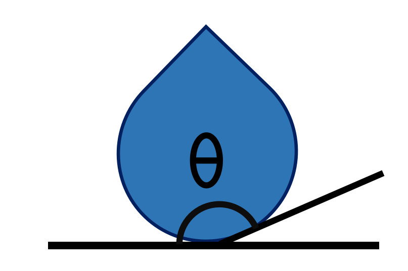

.. wetting_angle_kit documentation master file

Welcome to wetting_angle_kit's documentation!
===============================================

Introduction
============

wetting_angle_kit is a Python package that allows you to efficiently
analyze contact angles between a liquid drop and a solid surface
from Molecular Dynamics simulations.

Contents:

.. toctree::
   :maxdepth: 2
   :caption: Contents

   introduction/index
   tutorials/index
   examples/index
   API/index
