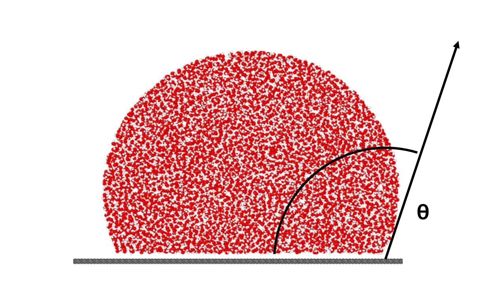
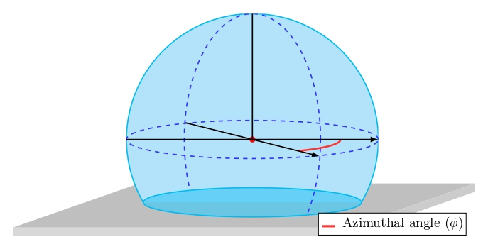
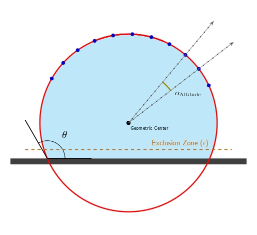
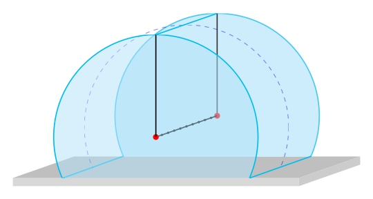

Theoretical foundations
======================

The contact angle is defined as the angle between the tangent to the liquid-vapor interface and the normal to the substrate. It is a measure of the wetting properties of a droplet on a surface.

The sliced method
----------------

To accurately define the liquid-vapor interface of the droplet, we employ a vertical slicing strategy along the z-axis. First, a definition of a 2D slicing plane passing through the droplet's geometric center is determined by an azimuthal angle.

Within this plane, we identify the interface coordinates by scanning radially from the geometric center. For a given axis (defined by an altitudinal angle), the local density is measured at discrete intervals. A function is then fitted to this density profile to locate the sharp drop in density that marks the limit between the liquid and vapor phases. This operation is repeated across a range of altitudinal angles to generate a cloud of points representing the droplet's profile on that plane.

To calculate the contact angle, points near the substrate are first excluded to avoid boundary effects. A circle is then fitted to the remaining interface points, and the contact angle is derived from the intersection of this circle with the bottom of the droplet (the substrate). Finally, the entire procedure is repeated for multiple azimuthal angles (rotating the slicing plane). This yields a distribution of contact angles, from which a mean contact angle is computed.

In the case of cylindrical droplets, the procedure is similar, but the slicing plane is defined by the axis of the cylinder and not an azimuthal angle. The slice is done along the axis of the cylinder, giving a list of angles along the axis of the cylinder.
