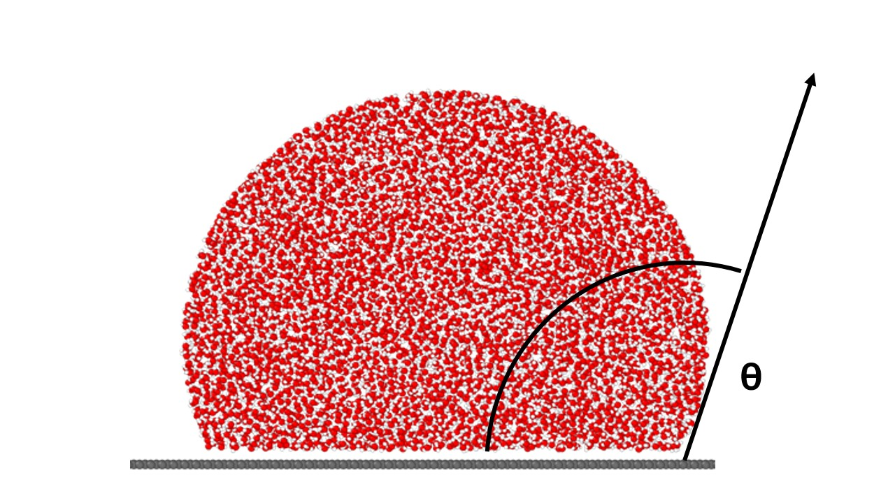
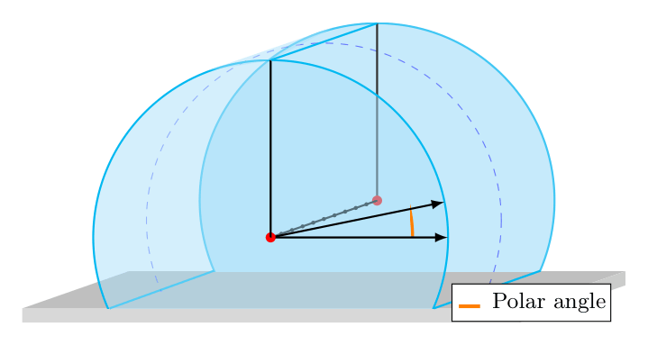

Theoretical foundations
=======================

This chapter walks through the physics and numerics behind
wetting_angle_kit, from the contact-angle definition to the
extraction, wall detection, and fitting strategies that the analyzers
compose.

.. contents::
   :local:
   :depth: 2

1. The contact angle and the cap geometry
-----------------------------------------

The contact angle :math:`\theta` is the angle between the tangent to
the liquid-vapor interface and the wall surface, measured through
the liquid. For an idealised spherical-cap droplet of radius
:math:`R` whose centre sits at height :math:`z_c` above the wall
plane :math:`z = z_w`, simple geometry gives

.. math::

   \cos \theta \;=\; \frac{z_w - z_c}{R}.

Physically:

* :math:`z_c < z_w` (sphere centre **below** the wall) ⇒
  :math:`\cos \theta > 0` ⇒ :math:`\theta < 90^\circ`: hydrophilic.
* :math:`z_c = z_w`: :math:`\theta = 90^\circ` (hemisphere).
* :math:`z_c > z_w`: :math:`\cos \theta < 0` ⇒ :math:`\theta > 90^\circ`:
  hydrophobic.

The same identity governs cylindrical droplets, replacing the
spherical cap by a circular cross-section in the plane perpendicular
to the cylinder axis.

The job of the analysis pipeline is to estimate :math:`R`,
:math:`z_c`, and :math:`z_w` from atom positions, robustly enough
that the recovered :math:`\theta` is meaningful.

2. The liquid–vapor interface in MD trajectories
------------------------------------------------

There is no sharp surface in an MD frame: the density drops from
:math:`\rho_{\rm liq}` to :math:`\rho_{\rm vap}` smoothly over a few
Å, broadened by thermal motion. The package treats the
liquid–vapor interface as the locus of half-bulk density.
This interface is then used to fit a circle/sphere and recover the contact angle.
The extraction of the interface is based on two choices:

* The density field may be computed via a Gaussian KDE or a 3D top-hat binning.
* The density may be sampled along rays from the droplet COM
  or on a fixed grid in space.

2.1. Estimating local density
^^^^^^^^^^^^^^^^^^^^^^^^^^^^^

We first need a local density estimate at each sample point.
Two estimators are available, swappable via :class:`DensityEstimator`:

**Gaussian KDE**
   Each atom contributes a normalised 3D Gaussian of width
   :math:`\sigma`:

   .. math::

      \rho_{\rm KDE}(\mathbf{r}) \;=\; \sum_i
        \frac{1}{(2\pi)^{3/2}\sigma^3}\,
        e^{-\|\mathbf{r} - \mathbf{r}_i\|^2 / 2\sigma^2}.

   Smooth and bias-controlled (the only knob is :math:`\sigma`),
   which makes it the default choice. For efficiency, a per-atom
   cut-off at :math:`5\sigma` is applied via a cKDTree.

**3D top-hat**
   Atoms within :math:`{\rm bin\_width}/2` of the sample contribute
   uniformly:

   .. math::

      \rho_{\rm bin}(\mathbf{r}) \;=\;
        \frac{N(\mathbf{r}, {\rm bin\_width}/2)}{V_{\rm bin}}.

   Fast and conceptually simple, but the hard cut-off introduces
   Poisson noise that can interfere with the tanh fit unless the bin
   width is matched to the smoothing length you'd otherwise pick.

Both estimators implement the same
:class:`DensityFieldProtocol`, so the analysis pipeline can plug
either one into the same ray-fan or grid extraction.

2.2. Sampling the density field
^^^^^^^^^^^^^^^^^^^^^^^^^^^^^^^

Two strategies turn the density estimator into a clean point set on
the interface:

**Ray fans**
  The :meth:`SpaceSampling.rays` factory emits a fan of rays from the droplet
  COM, samples the density along each ray, and recovers the interface
  position as the half-density point of a 1D tanh fit on that ray.

  In such samplings, the interface is recovered by fitting a one-dimensional
  hyperbolic-tangent profile to the density sampled along each ray:

  .. math::

    \rho(\zeta) \;=\; h \;+\; d\,\tanh(\zeta_d - \zeta),

  where :math:`\zeta` is the running coordinate along the ray and the
  three fitted parameters are the interface location :math:`\zeta_d`,
  the midpoint density :math:`h = (\rho_{\rm liq} + \rho_{\rm vap})/2`,
  and the half-amplitude :math:`d = (\rho_{\rm liq} - \rho_{\rm vap})/2`.
  The interface is :math:`\zeta = \zeta_d`, where :math:`\rho = h`.

  The transition **width** is *fixed* — the tanh argument has unit
  slope, giving a transition scale of order 1 Å — rather than being a
  fitted parameter. Because the profile is antisymmetric about its
  midpoint, the recovered half-density crossing :math:`\zeta_d` is
  largely insensitive to the exact width, so fixing the slope instead
  of fitting a thickness does not bias the interface location; only the
  amplitude/width interpretation would change, and the downstream
  geometry never uses it. (The coupled fit of §5 *does* treat the
  interface thicknesses :math:`t_1, t_2` as free parameters, because
  there the full density field — not just the crossing — is modelled.)

  This tanh profile is theoretically motivated by mean-field theory of
  liquid–vapor interfaces (van der Waals / Cahn–Hilliard square-gradient
  free energy) and is an excellent empirical fit to MD density
  profiles in the same regime.

  Four ray-fan geometries are used depending on the
  ``(surface_kind, droplet_geometry)`` pair:

  * **slicing + spherical**: a 2D ray fan in each azimuthal plane
    through the droplet (planes spaced by ``delta_azimuthal``);
    within each plane, rays at polar angles spaced by ``delta_polar``.
  * **slicing + cylinder**: a 2D ray fan in each ``y``-step plane
    (planes spaced by ``delta_cylinder``); same polar fan within each
    plane.
  * **whole + spherical**: a full-sphere Fibonacci ray fan from the
    COM. Equal-area in :math:`(\cos\theta, \phi)` with the golden
    angle in :math:`\phi`; total ray count is ``n_rays_sphere``.
    Full-sphere coverage is important: downward rays from the COM
    hit the wall plane and produce shell points at :math:`z \approx
    z_w`, which is what makes
    :meth:`WallDetector.min_plus_offset` work for the whole-fit.
  * **whole + cylinder**: a per-:math:`y` ray fan in the ``(x, z)``
    plane (planes spaced by ``delta_cylinder``); the resulting shell
    is the union of these per-:math:`y` rings.

  Why Fibonacci on the sphere? Naive uniform :math:`(\theta, \phi)`
  gridding clusters rays near the poles, oversampling there and
  undersampling the equator. The Fibonacci spiral (uniform
  :math:`\cos\theta`, golden angle :math:`\phi`) gives near-perfect
  equal-area coverage with no clustering anywhere.

**Grid + iso-contour**
  The :meth:`SpaceSampling.grid` factory builds a fixed-cell grid in space and
  computes a density value at each cell, then recovers the interface as
  the iso-density contour at the half-bulk level via
  :func:`skimage.measure.find_contours` in 2D (marching squares) or
  :func:`skimage.measure.marching_cubes` in 3D.

  In slicing mode, the grid sampling iterates **per slice** —
  azimuthal angles ``γ ∈ [0°, 180°)`` for spherical droplets, axial
  steps along ``y`` for cylinder droplets — exactly like the rays
  variant. Each slice yields an ``(s, z)`` density field and one
  iso-contour; the downstream :class:`SurfaceFitter.slicing` averages
  the per-slice angles and reports the inter-slice scatter, which is
  how the slicing method exposes droplet asymmetry.

  Two volume-normalisation notes:

  * ``grid`` + ``gaussian`` returns 3D density per ų directly from the KDE
    evaluation; no extra volume normalisation needed.
  * ``grid`` + ``binning``'s slab-cut histogram divides by
    ``ds × dz × dx`` so the recovered field is also in
    atoms/ų. The slab thickness equals ``dx`` (the in-plane
    horizontal cell width), which keeps the bin's cross-section in the
    ``(s, perpendicular)`` directions square.

3. Fitting the cap: algebraic Taubin fits
-----------------------------------------

Given a clean point set on the interface, the surface fitter
recovers the spherical-cap parameters :math:`(z_c, R)` (and
:math:`(x_c, y_c)` in 3D) via an **algebraic Taubin fit**.

A circle/sphere is the zero set of
:math:`g(\mathbf{r}) = A\,\|\mathbf{r}\|^2 + \mathbf{b}\cdot\mathbf{r} + c`
(a circle/sphere whenever :math:`A \neq 0`, with centre
:math:`\mathbf{r}_c = -\mathbf{b}/(2A)` and radius
:math:`R = \sqrt{\|\mathbf{b}\|^2/(4A^2) - c/A}`). The Taubin fit
recovers the coefficients by minimising the algebraic residual
normalised by its gradient,

.. math::

   \min_{A,\,\mathbf{b},\,c} \;
     \frac{\sum_i g(\mathbf{r}_i)^2}
          {\sum_i \|\nabla g(\mathbf{r}_i)\|^2}.

The solution is closed-form: after centring the data it is the
smallest right singular vector of a small design matrix (one SVD, no
iteration and no initial guess). The 2D circle fit is the same
construction with the :math:`y` column dropped.

The gradient normalisation is what makes this estimator
**near-unbiased on partial arcs**, which is the regime that matters
here: a droplet cap is only ever a partial arc — the liquid-vapor
surface, never the full circle — and on a short, noisy arc the
recovered radius feeds directly into
:math:`\cos\theta = (z_w - z_c)/R`. On synthetic arcs of known
radius the Taubin radius and angle match a full geometric
(orthogonal-distance) fit to well under :math:`0.1^\circ`, at no
extra variance; the geometric fit itself is avoided only because it
needs an iterative solve and an initial guess.

The slicing fitter (:meth:`SurfaceFitter.slicing`) runs one Taubin
**circle** fit per slice in the slice's ``(x, z)`` plane, then
averages the per-slice angles. The whole fitter
(:meth:`SurfaceFitter.whole`) runs one Taubin **sphere** fit
(spherical droplet) or one Taubin **circle** fit (cylindrical
droplet, exploiting translational symmetry along :math:`y`) on the
entire shell.

4. Locating the wall plane
--------------------------

The contact angle is read from the cap–wall intersection, so the
wall plane :math:`z_w` has to be located explicitly:

* :meth:`WallDetector.min_plus_offset` — derive :math:`z_w` from
  the interface itself, as :math:`z_w = \min(z_{\rm interface}) +
  \mathrm{offset}`. For slicing extractors the minimum across all
  slices' interface points lands on the contact line; for the
  full-sphere ray fan, downward rays from the COM reach the wall
  plane, so :math:`\min(z_{\rm shell})` is again physically
  meaningful.

* :meth:`WallDetector.from_atoms` — read wall-atom positions from
  the trajectory and place :math:`z_w` at the mean of the **top
  atomic layer** (atoms within ``top_layer_tolerance`` of the
  highest wall atom). Physically faithful when the simulation
  explicitly models the substrate.

* :meth:`WallDetector.explicit` — caller supplies :math:`z_w`
  directly. Useful when the wall position is known a priori from
  the simulation setup (e.g. a Lennard-Jones 9-3 wall at a known
  :math:`z`-coordinate).

A consequence worth remembering: the recovered angle is
sensitive to the wall position via the cap geometry
:math:`\cos \theta = (z_w - z_c)/R`. A 1.5 Å shift in :math:`z_w`
on a 25 Å droplet at :math:`\theta \approx 95^\circ` corresponds
to roughly a 3° shift in the recovered angle. So either pick the
wall detector that matches your trust budget, or report the angle
for two choices to make the dependence visible.

5. Coupled fit
--------------

The :class:`CoupledFit2DAnalyzer` and
:class:`CoupledFit3DAnalyzer` skip the
extractor/wall/fitter decomposition and fit a multi-parameter
density model directly to a density field on a fixed grid.

The per-cell density is computed by the same pluggable
:class:`DensityEstimator` strategy used elsewhere in the package:
either a top-hat histogram (:meth:`DensityEstimator.binning`, the
default) or a 3D Gaussian KDE evaluated at the cell centres
(:meth:`DensityEstimator.gaussian`). The binning variant is fast
and exact but intrinsically noisy at low per-cell atom counts; the
Gaussian variant smooths out Poisson noise at the cost of a small
constant overhead per batch. The choice of estimator does not
affect the model or the fit procedure — only the density values
fed into the NLLS solver.

5.1 The 2D model (7 parameters)
^^^^^^^^^^^^^^^^^^^^^^^^^^^^^^^

After projecting atoms to ``(xi, zi)`` via the droplet symmetry,
the analyzer computes a per-cell density and fits

.. math::

   \rho(\xi, z) \;=\; g(r) \cdot h(z - z_0),
   \qquad r = \sqrt{\xi^2 + (z - z_c)^2},

with

.. math::

   g(r) \;=\;
     \tfrac{1}{2}\bigl[(\rho_1 + \rho_2)
        - (\rho_1 - \rho_2)\tanh\!\bigl(2(r - R_{eq})/t_1\bigr)\bigr],
   \qquad
   h(\eta) \;=\;
     \tfrac{1}{2}\bigl[1 + \tanh\!\bigl(2 \eta / t_2\bigr)\bigr].

The radial sigmoid :math:`g(r)` describes the spherical-cap
interface; the vertical sigmoid :math:`h(z - z_0)` cuts off the
density below the wall plane :math:`z_0`. The seven free
parameters :math:`(\rho_1, \rho_2, R_{eq}, z_c, z_0, t_1, t_2)` are
fit simultaneously by a bounded nonlinear least-squares
(:func:`scipy.optimize.curve_fit`).

The contact angle follows directly:

.. math::

   \cos \theta \;=\; \frac{z_0 - z_c}{R_{eq}}.

5.2 The 3D model (9 parameters)
^^^^^^^^^^^^^^^^^^^^^^^^^^^^^^^

The 3D extension computes a density on a full ``(xi, yi, zi)``
Cartesian grid and fits

.. math::

   \rho(\xi, \eta, z) \;=\; g(r) \cdot h(z - z_0),
   \qquad r = \sqrt{(\xi - \xi_c)^2 + (\eta - \eta_c)^2 + (z - z_c)^2},

with two extra parameters :math:`\xi_c, \eta_c` for the
horizontal centre. Nine free parameters; same cap geometry for
:math:`\theta`. Spherical droplets only — cylindrical droplets are
rejected at construction because translational symmetry along the
cylinder axis already collapses the 3D problem onto the 2D one.

5.3 Why a coupled fit?
^^^^^^^^^^^^^^^^^^^^^^

The coupled fit shares information across the cap and the wall:
the radial sigmoid is constrained by the apex curvature and the
contact line simultaneously, and the vertical sigmoid pins the
wall plane against the cap's lower extent. Statistically more
efficient than the decoupled pipeline when you can afford to pool
many frames per batch; less informative per batch (single angle)
and slower per batch (a 7-parameter NLLS rather than one
closed-form Taubin solve per slice).

6. Periodic boundaries and droplet recentering
----------------------------------------------

MD simulations are run with periodic boundary conditions; a droplet
that drifts during the run can end up "split" across an :math:`x`
or :math:`y` periodic edge by the time you analyse a given frame.
A naive arithmetic mean of the atom positions would then place the
"centre" inside the empty vapor region between the two halves of
the droplet, ruining every downstream computation.

wetting_angle_kit uses a **circular-mean** recentering that handles
this automatically. For each periodic direction :math:`u \in
\{x, y\}`, atom positions :math:`u_i` are first mapped to the unit
circle:

.. math::

   \phi_i \;=\; 2\pi \, u_i / L_u,
   \qquad
   \bar\phi \;=\; {\rm atan2}\!\Bigl(\textstyle\sum_i \sin\phi_i,
     \;\textstyle\sum_i \cos\phi_i\Bigr).

The mean angle :math:`\bar\phi` is the circular mean; the
recentered atom positions are then

.. math::

   u_i' \;=\; ((u_i - L_u\bar\phi/(2\pi) + L_u/2) \bmod L_u) - L_u/2,

i.e. fold every atom into the box such that the droplet is
centred on the box's middle. Trajectories where the droplet
drifts or wraps across a periodic edge are handled transparently;
producing a pre-recentered trajectory at simulation time is
optional.

The single precondition is that the **simulation box must be large
enough that the droplet does not interact with its periodic
image** — i.e. the droplet's lateral diameter must be comfortably
below the box length. If that condition is violated, the radial
density profile is physically meaningless regardless of the
centering strategy.

7. Frame batching
-----------------

The :class:`TemporalAggregator` groups trajectory frames into
batches before the full pipeline runs. Three regimes are useful:

``batch_size=1``
   One pipeline run per frame. Best for time-resolved studies;
   the per-frame ``angle_std`` (per-slice scatter for slicing fits,
   bootstrap σ for whole fits) reports the within-frame
   uncertainty.

``batch_size=N``
   Pool :math:`N` consecutive frames before the fit. Fewer
   batches, more atoms per fit → less noise per angle, but you
   lose time resolution within each batch.

``batch_size=-1``
   Pool every requested frame into a single batch — one angle for
   the whole trajectory. The default for the coupled-fit analyzers;
   useful for the slicing/whole pipeline too when you only want a
   representative angle.

The trade-off: the per-batch fit cost scales with the number of
atoms in the batch (roughly linearly for ray fans, sub-linearly
for grid binning), but the noise on the recovered angle scales
inversely with :math:`\sqrt{N}` in regimes where shot noise
dominates. For a 4k-atom droplet on a typical room-temperature
trajectory, ``batch_size`` between 1 and 10 covers the useful
range.

8. Geometric symmetry classes
-----------------------------

Three geometries are supported via :class:`DropletGeometry`:

* ``"spherical"`` — full 3D droplet with no special axis.
* ``"cylinder_y"`` — cylindrical droplet along the :math:`y` axis
  (the internal frame's cylinder axis).
* ``"cylinder_x"`` — cylindrical droplet along the :math:`x` axis;
  internally swapped to ``cylinder_y`` for the analysis (atom
  positions are permuted, then the result is permuted back).

The geometry choice cascades through every component:

* the interface extractor picks a 2D/3D ray fan or grid axis;
* the wall detector reads :math:`\min(z)` over either the full
  interface or per-slice as appropriate;
* the surface fitter applies a sphere fit (spherical) or a 2D
  circle fit in :math:`(x, z)` (cylinder, using the translational
  invariance along :math:`y`).

The cylindrical case is mechanically identical to the spherical
one — same Taubin fit, same cap geometry, same :math:`\cos \theta
= (z_w - z_c)/R` — but applied per-axis-step rather than
azimuthally. The slicing tutorial includes a worked example;
the whole-fit tutorial covers the cylinder case under
"Alternative configurations".
