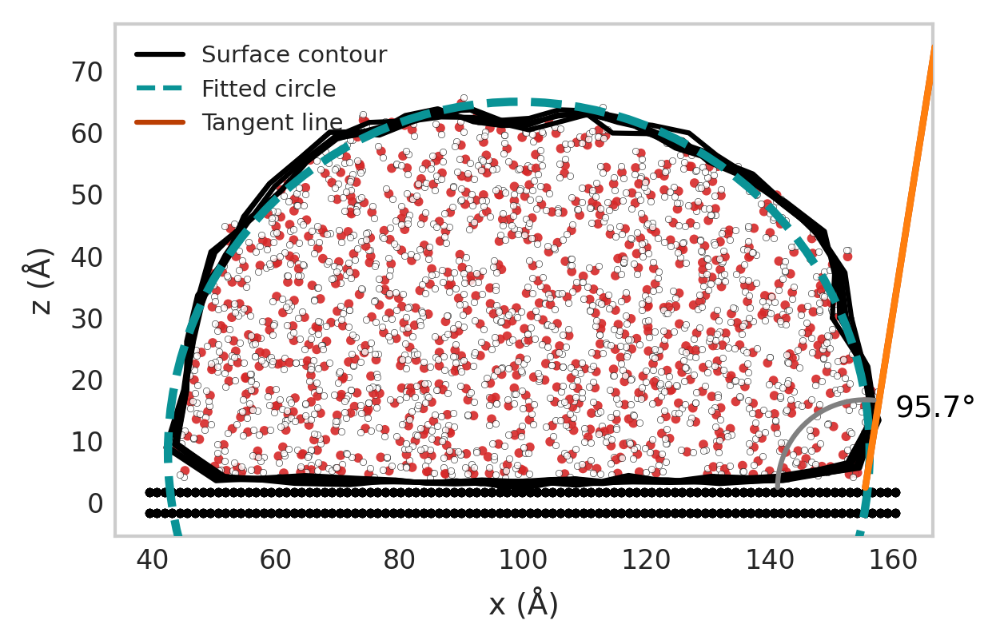

# Visualization Tutorial — Droplet Surface and Contact Angle

This tutorial demonstrates how to visualize a droplet and compute its contact angle using the **wetting_angle_kit** package. We'll use the `sliced` contact angle method and visualize the resulting droplet with the `DropletSlicePlotter` class.

---

## 1. Overview

The visualization workflow involves the following steps:

1. Parse atomic positions from a trajectory file.
2. Identify water molecules (oxygen and hydrogen atoms).
3. Compute the droplet surface and contact angle using the *sliced method*.
4. Visualize the droplet, fitted circle, tangent, and wall.

---

## 2. Import Required Modules
```python
import matplotlib

matplotlib.use("Agg")  # Required to prevent Qt conflicts with Ovito

import numpy as np
from wetting_angle_kit.parsers import (
    LammpsDumpParser,
    LammpsDumpWaterFinder,
    LammpsDumpWallParser,
)
from wetting_angle_kit.contact_angle_methods.sliced import ContactAngleSliced
from wetting_angle_kit.visualization import DropletSlicePlotter
```

---

## 3. Define the Input Trajectory
```python
filename = (
    "../wetting_angle_kit/tests/trajectories/traj_10_3_330w_nve_4k_reajust.lammpstrj"
)
```

---

## 4. Identify Water Molecules
```python
wat_find = LammpsDumpWaterFinder(
    filename, particle_type_wall={3}, oxygen_type=1, hydrogen_type=2
)

oxygen_indices = wat_find.get_water_oxygen_ids(frame_index=0)
print("Number of water molecules detected:", len(oxygen_indices))
```

---

## 5. Parse Atomic Coordinates
```python
parser = LammpsDumpParser(filepath=filename)
oxygen_position = parser.parse(frame_index=10, indices=oxygen_indices)

coord_wall = LammpsDumpWallParser(filename, liquid_particle_types=[1, 2])
wall_coords = coord_wall.parse(frame_index=1)
```

---

## 6. Compute Contact Angles
```python
processor = ContactAngleSliced(
    liquid_coordinates=oxygen_position,
    liquid_geom_center=np.mean(oxygen_position, axis=0),
    droplet_geometry="cylinder_y",
    delta_cylinder=5,
    max_dist=100,
    width_cylinder=21,
)

list_alfas, array_surfaces, array_popt = processor.predict_contact_angle()
print("Mean contact angles (°):", list_alfas)
```

---

## 7. Visualize the Droplet
```python
plotter = DropletSlicePlotter(center=True, show_wall=True, molecule_view=True)

plotter.plot_surface_points(
    oxygen_position=oxygen_position,
    surface_data=array_surfaces,
    popt=array_popt[0],
    wall_coords=wall_coords,
    output_filename="droplet_plot.png",
    alpha=list_alfas[0],
)

print(" Plot saved as 'droplet_plot.png'")
```
## Outputs



